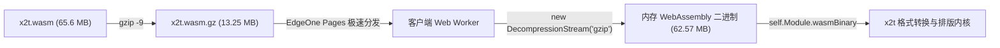

# ONLYOFFICE Compressed - 纯前端极致离线办公套件 (EdgeOne Pages 适配版)

> 本项目将 ONLYOFFICE 核心引擎完全移至前端浏览器运行，并采用 **Gzip Level 9 预压缩 + 浏览器原生 `DecompressionStream` 内存流式解压** 方案，将原本 65.6 MB 的 `x2t.wasm` 极致压缩至 **13.25 MB**（压缩率达 79.8%），彻底解除腾讯云 EdgeOne Pages（单文件不超过 25MB）及各类静态 Pages 托管平台的限制！

---

## ✨ 核心特性

- 🚀 **突破 Pages 25MB 限制**：
  全项目所有静态资产严格控制在 25MB 以内（最大文件仅 13.25 MB），完美契合腾讯云 EdgeOne Pages、Cloudflare Pages、GitHub Pages 等托管平台。
- ⚡ **原生流式解压**：
  利用现代浏览器底层标准的 `DecompressionStream('gzip')` API，在 Web Worker 中流式解码 WebAssembly 二进制并注入 Emscripten 运行时，秒级冷启动，零外部解压依赖。
- 🎨 **极简高颜值管理主页**：
  - 1:1 还原现代文档管理器界面：包含 Word、Excel、PowerPoint、PDF 四合一快速新建卡片。
  - 支持本地文件拖拽 / 选择上传、网络链接一键加载。
  - 本地历史记录管理（基于浏览器 IndexedDB），断网亦可持久化存储与管理。
- 💾 **全功能离线编辑与导出**：
  无需搭建任何后端服务，文档解析、格式互转、编辑、自动保存与本地导出均在本地浏览器安全完成，数据不出用户电脑。
- 🌿 **Git 双分支架构**：
  - `main`：完整项目源码、构建验证脚本及开发资源。
  - `pages`：发布专用分支，包含根目录 `index.html` 与编译成品，支持 EdgeOne Pages 关联分支直接上线。

---

## 🛠️ 技术方案解析

### 方案 1：Gzip 预压缩 + 客户端原生流式解压



1. **构建阶段**：采用 `gzip -9` 将 65.6MB 的 `x2t.wasm` 压缩至 13.25MB，文件体积减少近 80%。
2. **加载阶段**：Web Worker 通过 `fetch('./x2t.wasm.gz')` 获取，直接通过流管道 `response.body.pipeThrough(new DecompressionStream('gzip'))` 在内存中解压出原始 ArrayBuffer。
3. **注入阶段**：将 ArrayBuffer 传递给 `self.Module.wasmBinary`，并加载 `x2t.js` 胶水脚本，完全规避 CDN 平台的 Content-Encoding 头兼容性问题。

---

## 📂 项目结构

```text
OnlyofficeCompressed/
├── index.html                 # 门户首页 & ONLYOFFICE 编辑器容器 (SPA)
├── edgeone.json               # 腾讯云 EdgeOne Pages 路由与缓存配置
├── _headers                   # 通用 Pages 跨域与强缓存头
├── x2t/
│   ├── x2t.wasm.gz            # Gzip 压缩后的 WASM 核心 (13.25 MB < 25 MB)
│   ├── x2t.js                 # Emscripten WASM 胶水脚本
│   └── x2t.worker.js          # DecompressionStream 流式解压与多线程转换 Worker
├── v9.3.0.24-1/               # ONLYOFFICE 9.3 离线 WebApps 与 SDKJS
├── assets/
│   ├── css/style.css          # 文档管理器精美扁平化样式
│   └── js/
│       ├── app.js             # UI 交互、卡片逻辑、全屏切换
│       ├── db.js              # IndexedDB 本地文档库
│       ├── editor-runtime.js  # MockSocket、XHR/Fetch 代理与 EditorServer
│       └── empty.js           # 预编译空白文档模板 (DOCX/XLSX/PPTX/PDF)
└── scripts/
    └── verify-sizes.js        # 自动化文件体积合规校验脚本 (< 25MB)
```

---

## 🚀 部署至腾讯云 EdgeOne Pages

1. 登录 [腾讯云 EdgeOne Pages 控制台](https://console.cloud.tencent.com/edgeone/pages)。
2. 选择 **从 Git 仓库导入**，选择本仓库 `OnlyofficeCompressed`。
3. 构建配置：
   - **分支**：选择 `pages` 或 `main`（两分支根目录均已放置就绪的 `index.html`）。
   - **构建命令**：留空（纯静态无需二次打包）。
   - **输出目录**：留空或填写 `/`（根目录部署）。
4. 点击 **开始部署**，几秒后即可获得全球加速访问的公网链接！

---

## 💻 本地预览与开发

由于浏览器对 Web Worker 及 WebAssembly 加载有同源限制，请使用任意静态 HTTP 服务器运行：

```bash
# 方式 1: 使用 Python
python -m http.server 8080

# 方式 2: 使用 Node.js
npx serve .
```

在浏览器中打开 `http://localhost:8080` 即可立即体验！
