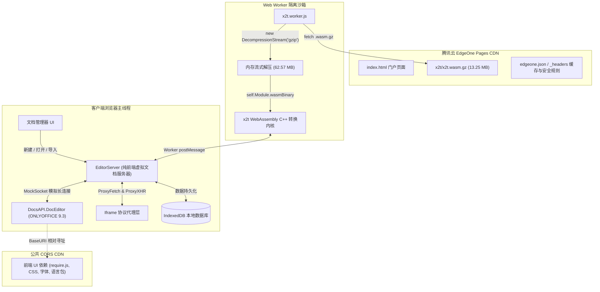

# ONLYOFFICE Compressed - 纯前端极致离线办公套件 (Pages 适配版)

> 本项目将 ONLYOFFICE 核心排版引擎完全移至前端浏览器运行，并采用 **Gzip Level 9 预压缩 + 浏览器原生 `DecompressionStream` 内存流式解压** 方案，将原本 65.6 MB 的 `x2t.wasm` 极致压缩至 **13.25 MB**（压缩率达 79.8%），彻底打破腾讯云 EdgeOne Pages、Cloudflare Pages、GitHub Pages 等静态托管平台单文件不超过 25MB 的硬性限制！

---

> [!CAUTION]
> ### ⚠️ 严禁滥用与免责声明 (Strict Prohibition of Abuse & Disclaimer)
> 1. **严禁用于商业牟利**：本项目仅供技术研究、跨平台静态部署方案探索与个人学习交流使用，**严禁将本项目直接或间接用于任何商业转售、商业 SaaS 包装、付费集成或商业盈利行为**。如需商业用途，请向 [ONLYOFFICE 官方](https://www.onlyoffice.com/) 采购商业许可授权。
> 2. **严禁用于非法用途**：严禁利用本项目处理、生成、传播任何包含违法违规、侵权盗版、色情低俗、政治敏感或破坏计算机信息系统安全的内容。
> 3. **资源合规与流量自律**：项目中依赖的编辑器外围公共静态资源由第三方公开 CDN 提供，使用者应秉持合理合规、非商业用途原则，严禁进行任何恶意盗刷、压力测试或大规模分发行为。
> 4. **免责保证**：本项目按“现状”（AS-IS）提供，不提供任何明示或暗示的担保。因使用、修改或分发本项目所产生的任何法律纠纷、数据丢失、知识产权争议或连带责任，均由使用者本人全权承担，本项目作者及贡献者概不负责。

---

## ✨ 核心特性

- 🚀 **突破 Pages 25MB 限制**：
  全项目所有静态资产严格控制在 25MB 以内（最大文件仅 13.25 MB），完美契合腾讯云 EdgeOne Pages、Cloudflare Pages、GitHub Pages 等托管平台。
- ⚡ **原生流式内存解码**：
  利用现代浏览器底层的 `DecompressionStream('gzip')` API，在独立 Web Worker 中边下载边解压 WebAssembly 二进制，直充内存，毫秒级冷启动，零额外解压库依赖。
- 🎨 **极简高颜值管理主页**：
  - 1:1 像素级还原现代文档管理器界面：包含 Word、Excel、PowerPoint、PDF 四合一快速新建卡片。
  - 支持本地文件拖拽 / 选择上传、网络链接一键加载。
  - **真实本地记录管理**：基于浏览器 IndexedDB，默认列表完全为空，用户实际新建、上传、导入、编辑保存的文档均如实持久化存储，离线可查。
- 💾 **全功能离线编辑与本地导出**：
  无需搭建复杂的后端服务集群，文档解析、格式互转、实时排版、自动保存与本地文件导出均在用户浏览器本地沙箱安全完成，**数据完全不出本地电脑**，兼具极致隐私安全。
- 🌿 **Git 双分支体系**：
  - `main`：完整项目源码、自动化测试脚本、构建校验脚本及开发文档。
  - `pages`：静态部署发布分支，根目录内置 `index.html` 与全量运行时，直接关联 EdgeOne Pages 一键上线。

---

## 🔬 核心技术原理解析

### 1. 架构总览

传统的 ONLYOFFICE Document Server 需要庞大的后端基础设施支撑（包括 Node.js 文档服务、x2t C++ 转换服务端、Redis 队列、RabbitMQ 以及 PostgreSQL 数据库）。本项目通过**全栈前端化重构**，将所有核心环节移植至浏览器端：



---

### 2. 四大核心技术机制

#### ① WASM Gzip 极限预压缩与客户端流式解压
- **痛点**：编译自 C++ 的核心排版与格式转换引擎 `x2t.wasm` 原始体积高达 **65.6 MB**，而主流静态托管服务均设有单文件 25 MB 的上限，无法直接上传部署。
- **实现**：
  1. **构建阶段**：采用 `gzip -9` 算法进行极限预压缩，将体积压减至 **13.25 MB**（压缩率达 79.8%），完全符合 Pages 限制。
  2. **传输与解码阶段**：在独立 Web Worker 中使用现代浏览器底层的原生流式 API 解压：
     ```javascript
     const response = await fetch(wasmGzUrl);
     const ds = new DecompressionStream('gzip');
     const decompressedStream = response.body.pipeThrough(ds);
     const wasmBinary = await new Response(decompressedStream).arrayBuffer();
     self.Module = { wasmBinary, noInitialRun: true, noExitRuntime: true };
     importScripts(scriptUrl);
     ```
  3. **优势**：
     - 解码过程在独立 Worker 线程中流式执行，完全不阻塞主线程 UI 渲染；
     - 避免依赖复杂的第三方解压库（如 pako/fflate），直接利用浏览器底层 C++ 实现，解压耗时仅需数十毫秒；
     - 解压完成的 WASM 字节码直接常驻内存，无需二次网络请求。

#### ② 纯前端虚拟服务层（Virtual EditorServer & MockSocket）
- ONLYOFFICE 核心前端脚本需要与 Document Server 建立长连接以进行权限验证、心跳保活和协作同步。
- 本项目在客户端通过无依赖的 `EventEmitter` 封装了 `MockSocket`，完全在内存中模拟了 ONLYOFFICE 专有通信协议：
  - 响应客户端 `connect` / `disconnect` 事件；
  - 模拟文档权限锁定、变更同步（`saveChanges` / `unSaveLock`）；
  - 拦截文档打开指令（`documentOpen`），将本地或内置模板的文档二进制送入编辑引擎。

#### ③ 智能 Iframe 代理与 BaseURI 隔离路由
- 编辑器主体运行在全屏独立的 `iframe` 容器中。我们通过 `createFetchProxy` 与 `createXHRProxy` 重构了 iframe 内部的网络调用链：
  - **保存与转换请求拦截**：当编辑器触发保存或导出（如 `/downloadas/`、`/upload/`）时，拦截器捕获数据包，并将其打包交由 Web Worker 中的 `x2t` 引擎执行双向格式互转（如 DOCX 互转、PDF 生成等）；
  - **静态外围资源直通**：庞大的外部 UI 资源（`require.js`、样式表、字库等）通过 `<base href>` 保持对公共高速 CDN 的相对寻址，Proxy 保证未被 Mock 规则匹配的常规资源直接原样交给原生 `fetch` 执行，避免了宿主与 iframe 之间的作用域污染。

#### ④ 零泄露本地 IndexedDB 存储
- 放弃传统的云端存储方案，所有真实文档（元数据、文件大小、最后修改时间、文件二进制数据）全部利用浏览器本地的 **IndexedDB** 数据库持久化存储；
- 最近打开文档列表完全根据用户在本地的实际使用行为实时记录，无操作时默认纯净为空，有效保障数据私密性，即使断开网络连接也能稳定使用。

---

## 📂 项目结构说明

```text
OnlyofficeCompressed/
├── index.html                 # 门户首页 & ONLYOFFICE 编辑器容器 (SPA 单页)
├── edgeone.json               # 腾讯云 EdgeOne Pages 路由规则与缓存策略配置
├── _headers                   # Pages 全局跨域与缓存响应头
├── serve.py                   # 本地轻量级调试 HTTP 服务器 (带 CORS)
├── start.bat                  # Windows 本地一键启动脚本
├── themes.json                # 主题配置文件
├── x2t/
│   ├── x2t.wasm.gz            # Gzip 压缩后的 WASM 核心引擎 (13.25 MB < 25 MB)
│   ├── x2t.js                 # Emscripten WASM 胶水脚本
│   └── x2t.worker.js          # DecompressionStream 流式解码与 x2t 转换 Worker
├── v9.3.0.24-1/               # ONLYOFFICE 9.3 离线 WebApps 与核心 API 脚本
├── assets/
│   ├── css/style.css          # 文档管理器高保真扁平化样式
│   └── js/
│       ├── app.js             # UI 交互、卡片新建、上传、拖拽与最近文件流转
│       ├── db.js              # IndexedDB 本地文档库持久化层
│       ├── editor-runtime.js  # EditorServer、MockSocket 与代理拦截核心运行时
│       └── empty.js           # 预编译空白文档模板 (DOCX/XLSX/PPTX/PDF)
└── scripts/
    ├── verify-sizes.py        # 自动化文件体积合规校验脚本 (< 25MB)
    ├── browser_test.py        # 基于 Chrome CDP 的自动化控制台与网络调试测试
    └── test_all_types.py      # Word/Excel/PPT/PDF 四大文体端到端全量自动化测试
```

---

## 🚀 部署至腾讯云 EdgeOne Pages

1. 登录 [腾讯云 EdgeOne Pages 控制台](https://console.cloud.tencent.com/edgeone/pages)。
2. 点击 **新建项目** -> **从 GitHub 仓库导入**。
3. 选择仓库 `OnlyofficeCompressed`。
4. 构建配置如下：
   - **生产分支**：选择 `pages` 或 `main`（两分支根目录均已放置就绪的 `index.html` 与全量静态文件）。
   - **构建命令**：**留空**（纯静态架构，无需执行任何打包编译命令）。
   - **输出目录**：**留空** 或填 `/`。
5. 点击 **开始部署**，约 10 秒后即可完成边缘节点全网分发，获得可直接访问的公网 HTTPS 域名！

---

## 💻 本地一键启动与调试

本项目内置了完备的本地调试环境支持，避免浏览器针对本地文件协议（`file://`）的跨域及 Worker 加载限制：

- **Windows 用户**：直接双击根目录下的 **`start.bat`**，系统将自动启动本地服务并打开浏览器。
- **命令行启动**：
  ```bash
  # 方式 1: 使用内置 Python 调试服务 (推荐，自带跨域头)
  python serve.py
  
  # 方式 2: 使用 Node.js 静态服务
  npx serve .
  ```
启动后访问 `http://127.0.0.1:8080` 即可在本地流畅体验。

---

## 🙏 致谢与开源声明

本项目的办公套件内核、格式转换引擎与前端运行时，均建立在下列开源项目之上，谨此致谢。

### 1. ONLYOFFICE —— 办公套件本体

| 项目 | 本项目中的对应部分 | 许可证 |
| --- | --- | --- |
| [ONLYOFFICE/web-apps](https://github.com/ONLYOFFICE/web-apps) | 编辑器前端外壳，对应 `v9.3.0.24-1/web-apps`（版权归 Ascensio System SIA） | AGPL-3.0（另含 Section 7(b)/(e) 附加条款） |
| [ONLYOFFICE/sdkjs](https://github.com/ONLYOFFICE/sdkjs) | 文档排版 / 渲染引擎，对应 `v9.3.0.24-1/sdkjs/*/sdk-all.js` 及字体子系统 | AGPL-3.0 |
| [ONLYOFFICE/core](https://github.com/ONLYOFFICE/core)（x2t） | 文档格式互转内核，对应 `x2t/x2t.wasm.gz` | AGPL-3.0 |
| [ONLYOFFICE DocumentServer](https://github.com/ONLYOFFICE/DocumentServer) | 原版前后端整体工程；本项目只取其前端部分做纯浏览器运行改造 | AGPL-3.0 |

> 编辑器界面的图标、插图等 GUI 素材采用 [CC BY-SA 4.0](https://creativecommons.org/licenses/by-sa/4.0/) 许可。

### 2. ZIZIYI Office —— 纯前端虚拟文档服务器思路的先行者

- 仓库：[baotlake/office-website](https://github.com/baotlake/office-website) ｜ 线上：[office.ziziyi.com](https://office.ziziyi.com/)
- 致谢理由：本项目「浏览器内虚拟文档服务器」的整体架构——由 `EditorServer` 充当伪服务端、`MockSocket` 模拟长连接协议、在 iframe 内用 XHR / Fetch 代理拦截编辑器请求、以及编辑器资源的离线化——参考并移植自该项目；本仓库在其基础上进一步完成了资源 gzip 极限压缩与全量自托管。

### 3. 随发行版一同打包的前端依赖

| 项目 | 版本 | 许可证 |
| --- | --- | --- |
| [jQuery](https://jquery.com/) | 3.7.1 | MIT |
| [Bootstrap](https://getbootstrap.com/) | 3.4.1（CSS） | MIT |
| [RequireJS](https://requirejs.org/) | — | MIT |
| [Socket.IO](https://socket.io/)（客户端） | 4.5.3 | MIT |
| [XRegExp](https://xregexp.com/) | — | MIT |
| [Monaco Editor](https://microsoft.github.io/monaco-editor/) | — | MIT |
| [perfect-scrollbar](https://github.com/mdbootstrap/perfect-scrollbar) | — | MIT |
| [Emscripten](https://emscripten.org/) | — | MIT / University of Illinois（x2t 与排版引擎 WASM 的构建工具链） |

`v9.3.0.24-1/fonts/` 下的字体文件随 ONLYOFFICE 发行版分发，各字体族仍保留其自身授权。

### 4. 声明

- 本项目为**非官方**的第三方改造版，并非 ONLYOFFICE 官方发行版；所有上游代码与素材的版权归原作者所有。
- 商业用途请向 [ONLYOFFICE 官方](https://www.onlyoffice.com/) 采购授权，并遵守文首《严禁滥用与免责声明》。
- 若上游作者认为署名方式需要调整，欢迎提 Issue 指正。
